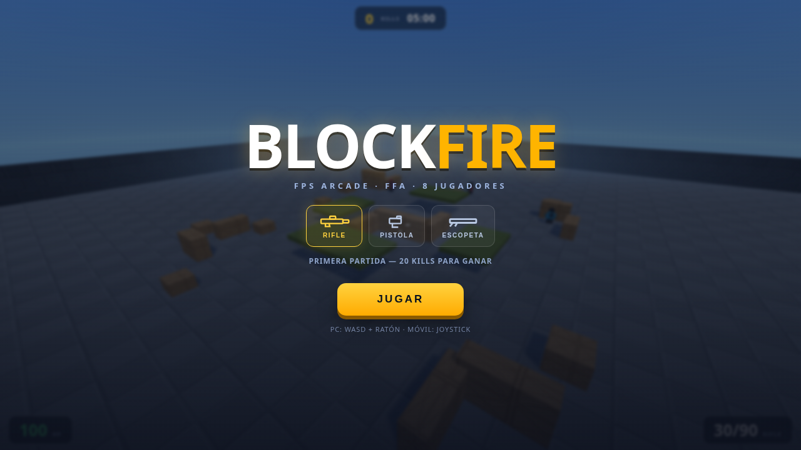
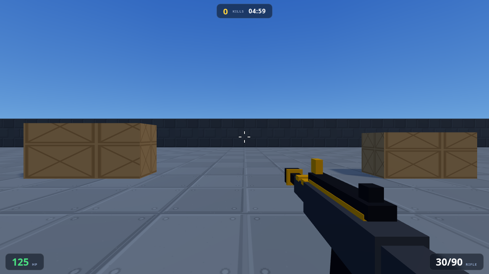
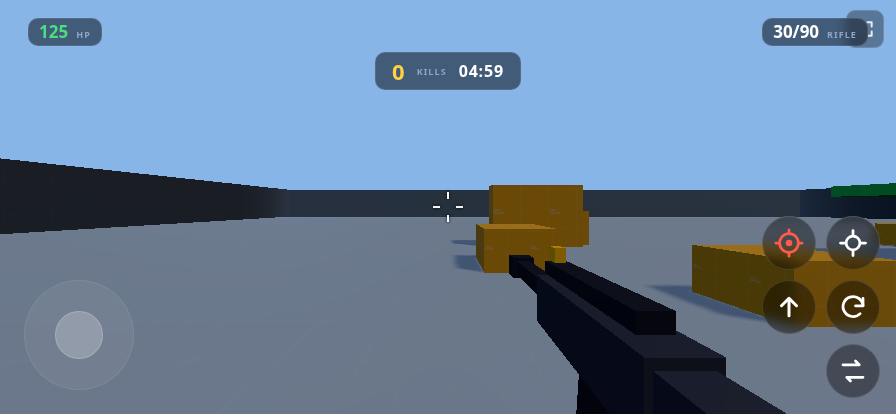

<div align="center">

# 🔥 BLOCKFIRE

**FPS blocky arcade — la base web es la referencia funcional; la migración nativa vive en `godot/`.**

Entras. Te mueves. Disparas. Matas. Mueres. Repites.
20 kills y ganas. Así de simple.

## 🎮 Dos versiones, un mismo juego

| | Web (Three.js) | Godot 4.7 |
|---|---|---|
| Estado | **Producto vivo** — la referencia | **Migración del núcleo** en curso |
| Jugable | ✔ completo (multitouch pulido) | ✔ núcleo jugable (third-person) |
| Cómo | `python3 -m http.server 8931` | `godot godot/` o APK (ver abajo) |
| Pruebas | `?runTests=1` (18) | selftest headless (16) |

### Godot (nativo — rama `godot-migration`)

```bash
# editor
godot ~/Documentos/BlockFire/godot        # requiere Godot 4.7.x
# probar desde terminal
godot --path godot
# tests headless
godot --headless --path godot scenes/main.tscn -- --selftest
# APK Android (debug, firmada con keystore de debug local)
godot --headless --path godot --export-debug "Android" builds/blockfire-debug.apk
```

Núcleo ya migrado: third-person player con paridad numérica del web (walk 7.2 /
sprint 8.6 / accel 58 / gravedad -22), 3 armas data-driven con hitscan+recoil+
tracer+muzzle flash, ruta única de daño/respawn con banners (+100/+150/+200/xN),
7 bots con NavigationAgent3D y oclusión real, arena con navmesh horneado en
runtime, HUD completo, controles táctiles con ownership por dedo (drag-fire,
ADS toggle), audio real con atenuación por distancia. **59.5 FPS (vsync) a
1080p en una iGPU HD 520.**

</div>

---

## 📱 REGLA PERMANENTE: HORIZONTAL

**BLOCKFIRE se juega EN HORIZONTAL — PC y Android, en TODAS las pantallas
(lobby, partida, configuración, todo).** No existe una versión vertical y el
gameplay no se adapta a portrait.

En móvil: si abres en vertical, un aviso a pantalla completa te pide girar el
dispositivo **antes** de tocar nada del juego. Al pulsar JUGAR, el juego pide
pantalla completa + bloqueo landscape (cuando el navegador lo permite).

## 🎮 Cómo se juega

| Acción | PC | Móvil |
|---|---|---|
| Mover | WASD | Joystick izquierdo (curva precisa) |
| Correr | Shift | Botón **CORRER** (fija) o joystick a tope |
| Mirar | Ratón | Deslizar en la mitad derecha — o arrastrar **FUEGO** |
| Disparar | Click izq | **FUEGO** (mantener) · arrástralo para apuntar mientras disparas |
| Apuntar (ADS) | Click der | **MIRA** un toque = fija; aparece **2º FUEGO** a la izquierda |
| Agacharse | C | Botón **COGER** (más preciso, más lento) |
| Saltar / Recargar | Espacio / R | Botones |
| Cambiar arma | 1-2-3 · Q/E cicla | Botón **ARMA** cicla |
| Ajustes en partida | — | Botón ⚙ (arriba-izquierda) |

- **Multitouch real**: mueve y mira a la vez; dispara con un dedo y mira con
  otro; nada se pisa ni queda pegado.
- **Elige tu arma en el lobby** (rifle, pistola o escopeta).
- **Asistencia de apuntado** activa en móvil: si apuntas cerca del pecho, la
  bala ayuda — pero todavía tienes que rastrear al enemigo.
- **125 de vida**: los duelos duran lo justo. La cobertura es real.

## ⚙️ Configuración (⚙ en partida, o CONFIGURACIÓN en el lobby)

- Sensibilidad de cámara (0.3×–2×) y sensibilidad ADS (0.3×–1×)
- **EDITAR CONTROLES**: arrastra cada botón y suéltalo donde quieras
- Tamaño y opacidad de los controles
- RESTAURAR vuelve todo por defecto. Se guarda en el dispositivo (localStorage).

## 🖼️ Así se ve

| Lobby | Partida |
|---|---|
|  |  |

| Móvil horizontal |
|---|
|  |

## ✨ Qué tiene

- 8 jugadores FFA (tú + 7 bots con **7 skins propias** y siluetas distintas)
- 3 armas con **modelos, siluetas y sonidos propios** (rifle mecánico, pistola
  seca, escopeta pesada), retroceso, recarga y cambio animados
- **Trazadoras** en cada disparo (los tuyos y los de los bots) + impactos
  diferenciados pared/enemigo + sangre
- Disparos reales grabados (Jesús Lastra CC-BY 3.0) + confirmaciones de combate
  diseñadas para el género (hit/headshot/kill/hurt/impacto/muerte)
- **Multitouch estilo FPS móvil**: fuego arrastrable, ADS por toque con segundo
  fuego, agacharse, sprint fijo; sin estados táctiles pegados
- Landscape obligatorio en móvil con instrucción ANTES del gameplay
- Screen shake, vignette de daño, **indicador direccional de daño**, respawn en 2s
- Mapa 96×96 con texturas CC0, cobertura y plataformas; spawns validados
- 60 FPS de presupuesto en PC y móviles modestos (resolución adaptativa)
- Lobby con selector de arma, estadísticas locales y panel de configuración

---

## 🛠️ Para desarrolladores / IAs

> **Las reglas del proyecto están en [`PROJECT_RULES.md`](PROJECT_RULES.md) — léelas antes de tocar código.**

Arquitectura (una responsabilidad por sistema):

```
src/main.js                    arranque, landscape gate y smoke tests
src/core/Settings.js           preferencias del jugador (localStorage)
src/core/Game.js               escena, ciclo, partida, daño y VFX
src/core/Input.js              teclado/mouse/pointer táctil → acciones neutrales
src/player/PlayerController.js movimiento, cámara, gravedad y respawn humano
src/combat/WeaponSystem.js     armas, hitscan, oclusión, aim assist y feedback
src/bots/Bot.js                IA: wander → chase → attack + walk cycle
src/world/Map.js               geometría, spawns validados, colisión y raycast
src/ui/HUD.js                  HUD, kill feed, banners y daño direccional
src/audio/AudioManager.js      samples (CC0/CC-BY) + fallback procedural
```

### Cómo ejecutar y probar

```bash
python3 -m http.server 8931        # desde la raíz del repo
# → http://localhost:8931          (el juego)
# → http://localhost:8931/?runTests=1   (suite de tests en pantalla)
```

En PC se puede probar el input táctil reduciendo la ventana a <900px de ancho.
Los tests también corren en headless: `chromium --headless=new ... ?runTests=1`.

---

## 📱 Estrategia Android (investigación — NO implementada todavía)

**Recomendación: PWA instalada → y encima una TWA (Trusted Web Activity) como APK.**
Razón: BLOCKFIRE es un sitio estático sin build — el mismo hosting web sirve a
PC y a Android, y las actualizaciones llegan sin reconstruir la APK (la TWA es
solo un contenedor del Chrome del sistema).

| Opción | Veredicto | Por qué |
|---|---|---|
| **TWA (Bubblewrap)** | ✅ La viable | APK mínima (~2MB) sin código propio: abre tu URL en Chrome a pantalla completa con `orientation: landscape` forzado vía manifest. Actualizaciones = subir archivos al host. Requiere HTTPS + `assetlinks.json`. |
| PWA instalada | ✅ Paso previo | El mismo manifest (`display: fullscreen`, `orientation: landscape`) hace al juego instalable con landscape bloqueado por el SO, sin APK. Primera etapa natural. |
| WebView propio | ❌ No recomendado | Heredas ciclo de vida, latencia de input, audio y compat WebGL de la WebView del dispositivo sin beneficio real frente a TWA. |

Pasos futuros (cuando se apruebe): hosting HTTPS → `manifest.json` (nombre,
iconos, `display: fullscreen`, `orientation: landscape`, `theme_color`) → service
worker mínimo para cache/offline → `bubblewrap init --manifest` → APK firmada.
El juego web sigue siendo el producto principal; la APK no reescribe nada.
Audio necesita un gesto de usuario para arrancar (ya implementado: botón JUGAR).
