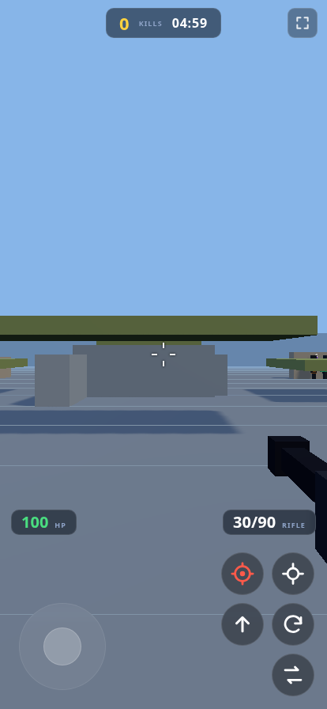

<div align="center">

# 🔥 BLOCKFIRE

**FPS arcade 3D blocky — corre en tu navegador, gratis.**

Entras. Te mueves. Disparas. Matas. Mueres. Repites.
20 kills y ganas. Así de simple.

[▶ **JUGAR AHORA**](#-jugar) · 1 minuto en montarlo

</div>

---

## ▶ Jugar

```bash
python3 -m http.server 8002
# abre http://localhost:8002
```

En el móvil (misma red WiFi): `http://TU_IP:8002` — y toca el botón de
pantalla completa ⛶ para jugar sin la barra del navegador.

## 🎮 Cómo se juega

| Acción | PC | Móvil |
|---|---|---|
| Mover | WASD | Joystick izquierdo |
| Mirar | Ratón | Deslizar pantalla |
| Disparar | Click izq | Botón rojo 🔴 |
| Apuntar (ADS) | Click der | Botón mira |
| Saltar / Recargar / Cambiar arma | Espacio / R / 1-2-3 | Botones |

- **Elige tu arma en el lobby** (rifle, pistola o escopeta) antes de entrar.
- **Asistencia de apuntado** activa en móvil: si apuntas cerca del pecho, la
  bala ayuda — pero todavía tienes que rastrear al enemigo.
- **125 de vida**: los duelos duran lo justo. La cobertura es real.

## 🖼️ Así se ve

| Lobby | Partida |
|---|---|
|  |  |

| Móvil vertical | Móvil horizontal |
|---|---|
|  |  |

## ✨ Qué tiene

- 8 jugadores FFA (tú + 7 bots con estilos visuales distintos y caminata propia)
- 3 armas con retroceso, recarga y cambio animados
- **Asistencia de apuntado** (más generosa en móvil) + 125 HP: duelos con duelo
- Sonidos e impactos reales (assets CC0 de Kenney), pasos, kill banner, headshots
- Screen shake, vignette de daño, respawn en 2 segundos
- Mapa 96×96 con texturas CC0, cobertura y plataformas; spawns validados
- 60 FPS de presupuesto en PC y móviles modestos (resolución adaptativa)
- Lobby con selector de arma y estadísticas de tus partidas (guardadas localmente)

---

## 🛠️ Para desarrolladores / IAs

> **Las reglas del proyecto están en [`PROJECT_RULES.md`](PROJECT_RULES.md) — léelas antes de tocar código.**

Arquitectura (una responsabilidad por sistema):

```
src/main.js                    arranque y smoke tests
src/core/Game.js               escena, ciclo, partida, daño y VFX
src/core/Input.js              teclado/mouse/táctil → acciones neutrales
src/player/PlayerController.js movimiento, cámara, gravedad y respawn humano
src/combat/WeaponSystem.js     armas, hitscan, oclusión, aim assist y feedback
src/bots/Bot.js                IA: wander → chase → attack + walk cycle
src/world/Map.js               geometría, spawns validados, colisión y raycast
src/ui/HUD.js                  HUD, kill feed y banners
src/audio/AudioManager.js      samples CC0 + fallback procedural
```

Convenciones críticas:

- `position.y` = altura de **ojo**; pies en `y − height`. Meshes apoyados con
  pies exactos en `getGroundY()`.
- `Map.raycast` (slab AABB) resuelve oclusión **antes** de aplicar daño.
- Spawns se validan contra colisión (`isSpawnClear`) — nadie nace dentro de
  paredes.
- `?runTests=1` — **7/7 PASS obligatorio** antes de aceptar cualquier cambio.
- Assets externos: solo CC0, listados en [`CREDITS.md`](CREDITS.md).
- Verificación visual: `tools/gemini-vision.py` (key en `.env`, gitignored).
