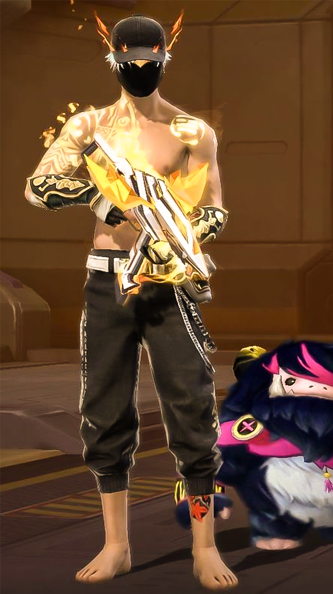
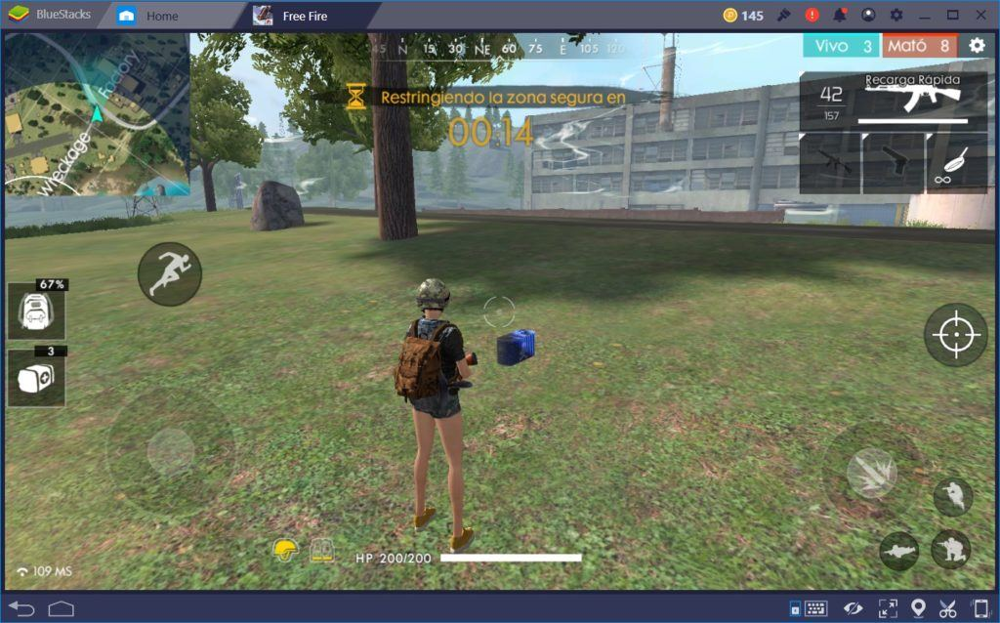

<div align="center">

# 🔥 BLOCKFIRE

**TPS arcade Godot para Android (tercera persona sobre el hombro), con laboratorio Linux headless.**

Entras. Te mueves. Disparas. Matas. Mueres. Repites.
Duelo de Escuadras 4v4 por rondas o Todos contra Todos a 20 kills.

</div>

## Estado y arquitectura

El runtime canónico usa Godot 4.7.2 Standard, GDScript y renderer Mobile. La
entrega Android fija orientación landscape y se exporta como APK. El proyecto
mantiene una sola ruta de juego; no depende de Unity, navegador, WebView,
PWA, Three.js ni Capacitor.

| Área | Dueño |
|---|---|
| Arranque y escenas | `game/app.gd`, `game/app.tscn` |
| Partida, rondas y daño | `game/match/match.gd`, `game/match/*_rules.gd` |
| Jugador, cámara y aim assist | `game/player/player.gd` |
| Entrada táctil y layout | `game/ui/mobile_controls.gd`, `game/ui/control_editor.gd` |
| Armas e impactos | `game/weapons/weapon_controller.gd` |
| Bots y navegación | `game/bots/bot.gd`, `game/world/arena.gd` |
| Mundo y decoración | `game/world/arena.gd` |
| HUD y lobby | `game/ui/hud.gd`, `game/lobby/lobby.gd` |
| Audio y ajustes | `game/audio/`, `game/settings_store.gd` |
| Suite DEV | `tests/smoke.gd`, `tools/` |

El único autoload actual es `SettingsStore`, que persiste ajustes locales y
aplica volumen. La navegación de código está resumida en
[`docs/CODEMAP.md`](docs/CODEMAP.md).

## Objetivo visual vinculante

BLOCKFIRE se dirige como un shooter móvil **en tercera persona sobre el
hombro**. La referencia de producto fija estas decisiones, que prevalecen
sobre cualquier placeholder anterior:

- Personaje principal: humano adulto original, proporción semi-realista,
  streetwear táctico, máscara/capucha o gorra y ropa modular con diferencias
  reales de silueta. No personajes voxel, chibi, Toon Shooter, ni variantes
  que solamente cambian RGB.
- Cámara: el cuerpo, mochila/ropa y arma deben leerse durante la partida; la
  mira y la asistencia móvil se dirigen al torso con línea de visión, sin
  autofuego ni disparos a través de obstáculos.
- Mundo: exterior habitable con terreno, vegetación, roca, construcciones y
  cobertura reconocible. Quedan descartadas las arenas de cajas/bloques como
  dirección final.
- HUD: limpio y periférico; movimiento abajo a la izquierda y disparo/mira a
  la derecha, sin tapar al personaje ni el objetivo.
- Armas: silueta plausible y orientación correcta en manos; no generación
  procedural visible como arte final.

Las imágenes de referencia proporcionadas por el usuario quedan archivadas
como guía interna de dirección —no son assets del runtime ni se copian sus
personajes, armas, UI, marcas o trade dress—. La implementación debe crear una
identidad original y usar únicamente assets con licencia compatible y
atribución en [`CREDITS.md`](CREDITS.md).

| Referencia de personaje | Referencia de partida TPS |
|---|---|
|  |  |

El objetivo visual que se revisa contra estas capturas es: cuerpo completo
legible, cámara sobre el hombro, arma en manos y un exterior jugable con
profundidad. No se acepta volver a bloques, Minecraft, Toon o packs low-poly
como dirección final.

### Rig y animación en integración

La base técnica que ya está dentro del proyecto es
[`assets/models/animation_library/`](assets/models/animation_library/):
Universal Animation Library 1/2 (CC0), con un esqueleto humano de 65 huesos y
clips de locomoción, apuntado, disparo, recarga, salto y muerte. Se usa la
variante sin root motion porque el movimiento lo gobierna el jugador. El
rigged de [`assets/models/skins/`](assets/models/skins/) ya está conectado como
skin técnica temporal: conserva su `Skeleton3D`, remapea los huesos de
deformación al convenio UAL y copia los clips a su `AnimationPlayer` en
runtime. Su estética anime sólo valida la tubería; no reemplaza el objetivo
semi-realista ni autoriza volver a Toon/voxel. Godot importa los nombres sin el
sufijo `_Loop` del archivo original (`Idle`, `Jog_Fwd`, `Sprint`, etc.). La
atribución del modelo está en [`CREDITS.md`](CREDITS.md).

## Comandos

Los scripts encuentran Godot en PATH o mediante `BLOCKFIRE_GODOT`:

```bash
BLOCKFIRE_GODOT=/ruta/a/godot tools/test.sh
BLOCKFIRE_GODOT=/ruta/a/godot tools/run-game.sh -- --qa-squad
BLOCKFIRE_GODOT=/ruta/a/godot tools/run-game.sh -- --qa-ffa
BLOCKFIRE_GODOT=/ruta/a/godot tools/run-game.sh -- --qa-combat
BLOCKFIRE_GODOT=/ruta/a/godot tools/run-game.sh -- --qa-editor
BLOCKFIRE_GODOT=/ruta/a/godot tools/run-mobile-qa.sh
BLOCKFIRE_GODOT=/ruta/a/godot tools/build-android.sh
```

`--qa-combat` omite la espera de compra para comprobaciones rápidas;
`--qa-editor` abre el editor de controles táctiles. El APK se escribe en
`builds/blockfire-debug.apk`, una salida generada y no versionada.

## Producto y controles

- Escuadras 4v4: compra, combate sin respawn, espectador y primero a cuatro
  rondas; no hay empate.
- FFA: ocho combatientes, respawn y objetivo de 20 kills.
- Jugador a 200 HP, cuatro armas, bots con roles, percepción y
  `NavigationAgent3D`.
- Aim assist móvil fuerte pero acotado por cono, distancia y línea de visión;
  no dispara ni atraviesa paredes por el jugador.
- Lobby de operadores, tienda de ronda, skins locales, feedback de daño,
  audio, VFX y HUD.

| Acción | PC | Móvil |
|---|---|---|
| Mover | WASD | Joystick izquierdo |
| Correr | Shift | CORRER o joystick a tope |
| Mirar | Ratón | Arrastre derecho o arrastre de FUEGO |
| Disparar | Click izquierdo | FUEGO, mantenido y arrastrable |
| Apuntar | Click derecho | MIRA, con multitouch |
| Agacharse | C | AGACHAR |
| Saltar / recargar | Espacio / R | Botones |
| Cambiar arma | 1–4, Q/E | ARMA |

`CONFIGURACIÓN → EDITAR CONTROLES` persiste posición normalizada, tamaño y
opacidad, respetando la safe area. Perder foco, visibilidad u orientación
libera los estados táctiles.

## Verificación y legal

La suite `tools/test.sh` protege los contratos de gameplay, input, arsenal,
operadores y editor. El export Android es un gate separado. Android físico
es la autoridad para orientación, multitouch, audio, suspensión/reanudación y
rendimiento; el laboratorio Linux no sustituye esa comprobación.

Consulta [`CREDITS.md`](CREDITS.md) para las licencias y atribuciones.
